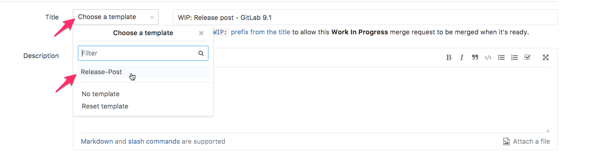
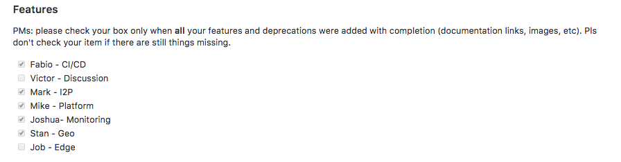

<br>

### Release Blog Posts Handbook
{:.no_toc}

----

## On this page
{:.no_toc}

- TOC
{:toc}

----

## Release posts

GitLab releases a new version every 22nd of each month,
and announces it through monthly release posts.

Patch and security issues are addressed more often,
whenever necessary.

- For a list of release posts, please check the
category [release](/blog/categories/release/).
- For a list of security releases, please check
the category [security release](/blog/categories/security-release/).
- For a list of features per release, please check
the [releases](/releases/).
- For all named changes, please check the changelog
for [GitLab CE](https://gitlab.com/gitlab-org/gitlab-ce/blob/master/CHANGELOG.md)
and [GitLab EE](https://gitlab.com/gitlab-org/gitlab-ee/blob/master/CHANGELOG.md).
- See also [release managers](/release-managers/).

### Templates

To start a new release post, please choose one of
these templates, and follow their instructions
to insert content. Please make sure to use
the most recent template available.

- [Monthly release](#getting-started)
- [Patch release](https://gitlab.com/gitlab-com/www-gitlab-com/blob/master/doc/templates/blog/patch_release_blog_template.html.md)
- [Security release](https://gitlab.com/gitlab-com/www-gitlab-com/blob/master/doc/templates/blog/security_release_blog_template.html.md)

For patch and security releases, please make sure
to specify them in the title, add the correct [category](../#categories):

- Patch releases:
  - `title: "GitLab Patch Release: x.x.x and x.x.x"`
  - `categories: release`
- Security releases:
  - `title: "GitLab Security Release: x.x.x and x.x.x"`
  - `categories: security release`

----

## Monthly releases

Monthly releases have an exclusive layout aiming to appraise the reader
with the presentation of a new release every 22nd.

**Note:** The new design for monthly release posts was
 [introduced](https://gitlab.com/gitlab-com/www-gitlab-com/merge_requests/4780)
in March 2017 with the release of
[GitLab 9.0](/2017/03/22/gitlab-9-0-released/).
The new layout was [introduced](https://gitlab.com/gitlab-com/www-gitlab-com/merge_requests/5937) in May 2017 with the release of [GitLab 9.2](/2017/03/22/gitlab-9-2-released/).

### Getting started

To create a new monthly release post, add two files to the [about.GitLab.com repository](https://gitlab.com/gitlab-com/www-gitlab-com/blob/master/) (consider the release of GitLab X.Y, released in YYYY/MM/DD):

- A YAML data file, containing all the release post content
  - Into `data/release_posts/`, add a new file called `YYYY_MM_22_gitlab_X_Y_released.yml`
  - Template ([latest version](https://gitlab.com/gitlab-com/www-gitlab-com/blob/master/doc/templates/blog/YYYY_MM_DD_gitlab_x_y_released.yml))
- A blog post file, containing the introduction and the blog post frontmatter information
  - Into `source/posts/`, add a new file called `YYYY-MM-22-gitlab-X-Y-released.html.md`
  - Template ([latest version](https://gitlab.com/gitlab-com/www-gitlab-com/blob/master/doc/templates/blog/monthly_release_blog_template.html.md))

**Important!** Please use the most recent templates for each of these files.

#### Merge Request

Create a merge request with the introductory changes _before the kick off call_
to make the post available to receive contributions from the team.

Set the title to "WIP: Release post - GitLab X.Y".

Check "Remove source branch when merge request is accepted".
Consider to check "Squash commits when merge request is accepted" only if there are too many commits that are useless (typos, styling, etc...).

The branch name must be `release-X-Y`.

Please use the release post template for your MR:

{:.shadow}

**Important**: all the files related to the release process, including `data/features.yml`, `data/mvps.yml` and `data/promo.yml` must be committed in this MR.
{:.alert .alert-info}

#### Authorship

Each month a Product Manager will lead the release post, being accountable for:

- Creating the [merge request](#merge-request)
- Writing the blog post [introduction](#introduction)
- Writing the [performance improvements](#performance-improvements) section
- Choosing the [MVP](#mvp), writing the post section, and updating `data/mvps.yml`
- Adding the [cover image](#cover-image) and the [social sharing image](#social-sharing-image)
- Updating the promo file (`data/promo.yml`)
- Making sure all feature descriptions are positive and cheerful
- Making sure all the features listed in the [direction](/direction/)
page are included in the post
- @mentioning the [release manager](/release-managers/) to remind them
to add the [upgrade barometer](#upgrade-barometer) section
- Helping to solve all comments in the thread (bugging people on chat)
- Making sure all images (png, jpg, and gifs) are smaller than 300 KB each
- Ping the PMs on Slack asking for anything missing, wrong, or pending feedback
- On the 16th (or the following workday), run the release post through an
automated spell and grammar check
- Assigning the MR to the reviewers (tech writing team, marketing, Job)
when it's ready for their reviews
- Pull `master` into the release post on the 21st to make sure there are
no merge conflicts (do not rebase, please do `git pull origin master`, then `:wq`)
- Making sure we have the post **ready to merge two working days before the 22nd**
- Merging the post on the 22nd (coordinate with the release manager in the
`#releases` chat channel to only merge the post once deploy has completed
and the packages published)
- Posting on Social Media (Twitter/Facebook) or, in case you don't have access,
coordinating with someone who has (e.g. Marcia, Erica, Rebecca, Emily vH)
- Adding any updates on the the release post process to the handbook

#### PM authorship schedule

- 9.0 March 22, 2017 Victor W
- 9.1 April 22, 2017 Victor W
- 9.2 May 22, 2017 Joshua L
- 9.3 June 22, 2017 Fabio B
- 9.4 July 22, 2017 Marcia M
- 9.5 August 22, 2017 Marcia M
- 10.0 September 22, 2017 Mike Bartlett
- 10.1 October 22, 2017 Achilleas P
- 10.2 November 22, 2017 Joshua L
- 10.3 December 22, 2017 Mark P
- 10.4 January 22, 2018 James R
- 10.5 February 22, 2018 Victor W

#### Stages of contribution

Monthly release posts are created in two stages:

- **General contributions**: everyone can contribute!
In this stage, Product Managers will add features and their
respective images, videos, etc. Team members are also welcome
to contribute.
- **Review**:
  - **Content**: the blog post author will review the content
  and copyedit anything necessary
  - **Structure**: tech writing/frontend/ux check the syntax
  and the structure of the blog post.

To be able to finish our work in time, with no rush,
each stage will have its due date.

### Due dates

To having the release post well written and ready in
time for the release date, please set due dates for:

- [General contributions](#general-contributions) from the Product Managers and
the team: 6th working day before the 22nd
- [Review](#review): 2nd working day before the 22nd

Ideally, the review should be completed until the 4th working day before the 22nd,
so that the 3rd and the 2nd working day before the release
could be left for fixes and small improvements.

### General contributions

Added by the team until the 6th working day before
the 22nd. Please fill all the [sections](#sections).

They are mostly added by the Product Managers, each filling up
the sections they are [accountable for](/handbook/product/#who-to-talk-to-for-what).

#### Accountability

**You are responsible for the content you add to the blog post**. Therefore,
make sure that:

- all new features in this release are in the release post.
- all the entries are correct and not missing (especially links to
the documentation or feature webpages when available).
- feature availability: add the correct entry (CE, EES, EEP).
- all images are optimized (compressed with [ImageOptim](https://imageoptim.com),
[TinyPNG](https://tinypng.com/), or other tool of your preference) **and** smaller than 300KB.
- if you are adding a gif, it should be compressed as much as possible
and smaller than 300KB. If it's bigger than that, use a video instead.
- all primary features are accompanied by their images.
- all new features are added to [`data/features.yml`](https://gitlab.com/gitlab-com/www-gitlab-com/blob/master/doc/features.md) _with a screenshot accompanying the feature_.

Write the description of every feature as you do
to regular blog posts. Please write according to
the [markdown guide](/handbook/product/technical-writing/markdown-guide/).

<i class="fa fa-exclamation-triangle" aria-hidden="true" style="color: red"></i>
**Important!** Make sure to merge `master` into the release post branch **before
pushing changes** to any existing file to avoid merge conflicts. Do not rebase,
do `git pull origin master` then `:wq`.
{: .alert .alert-info}

#### PMs checklist

Once the PMs have included everything they're accountable for, they should
**check their item** in the release post MR description: `<MR link>#features`:

```hmtl
https://gitlab.com/gitlab-com/www-gitlab-com/merge_requests/6239#features
```

{:.shadow}

By checking your item, you will make it clear to the author that you have
done your part in time (during the general contributions stage) and
you're waiting for review. If you don't check it, it's implicit that you
didn't finish your part in time, despite that's the case or not.

#### Notes for PMs

**Vacations:**

If you are on vacations before/during the release fill all your items, and create
placeholders in the release post Yaml file for all the items you cannot add for
whatever reason. To complete them, and to follow up with all the content you are
responsible for, assign someone to take over for you and notify the author.

**Replies:**

Please respond to comments in the MR thread as soon as possible.
We have a non-negotiable due date for release posts.

**Documentation:**

Please add the `documentation_link` at the same time you add a feature block to
the release post. When you leave it to add it later, you will probably
forget it, the reviewer will ping you later on during the review stage,
and you will have little time to write, get your MR reviewed, approved, merged, and
available in docs.gitlab.com/ee.

## Monthly release blog post sections
{:#sections}

- [Introduction](#introduction)
- [CTA buttons](#cta)
- [MVP](#mvp)
- [Features](#features)
  - [Top feature](#top-feature)
  - [Primary features](#primary-features)
  - [Secondary features (improvements)](#improvements)
  - [Illustrations](#illustrations) (screenshots, gifs, or videos)
  accompanying their respective features
- [Performance improvements](#performance-improvements) (added as a secondary feature)
- [Omnibus improvements](#omnibus-improvements) (added as a secondary feature)
- [Upgrade barometer](#upgrade-barometer)
- [Deprecations](#deprecations)

### Introduction

Add the introduction to the blog post file (`YYYY-MM-DD-gitlab-X-Y-released.html.md`),
in regular markdown.

Add a short paragraph before the `<!-- more -->` separator, and
conclude the intro below it.


```md
Introductory paragraph (regular markdown)

<!-- more -->

Introduction (regular markdown)
```

The first paragraph is the one that catches the eyes of the reader,
so it should be super cheerful and invite the person to know what
we're shipping that month.

The following paragraphs should briefly highlight what's in the post,
and link to each feature description introduced by that release
(link using the feature headings' anchors).

Make your intro creative and attractive, shouting out for all the
awesomeness we're shipping that month.

### CTA

Call-to-action buttons displayed at the end of the introduction.
A CTA to the [events page](/events/) is added by default. Add webcasts,
or custom buttons to this entry whenever necessary.

```yaml
cta:
  - title: Join us for an upcoming event
    link: '/events/'
  - title: Lorem ipsum dolor sit amet
  - link:
```

### MVP

To display the MVP of the month, use the example
provided in this template, and adjust it to your case.
Don't forget to link to the MR with the MVP's contribution.

```yaml
mvp:
  fullname: Dosuken Shinya # full name
  gitlab: dosuken123 # gitlab.com username
  description: | # supports markdown. Please link to the MR with the MVP's contribution.
    Dosuken extended our [Pipelines API](http://docs.gitlab.com/ce/api/pipelines.html#list-project-pipelines)
    by [adding additional search attributes](https://gitlab.com/gitlab-org/gitlab-ce/merge_requests/9367).
    This is a huge improvement to our CI API, for example enabling queries to easily return the latest
    pipeline for a specific branch, as well as a host of other possibilities. Dosuken also made a great
    contribution last release, laying the foundation for
    [scheduled pipelines](https://gitlab.com/gitlab-org/gitlab-ce/merge_requests/10133). Thanks Dosuken!
```

Suggestions should be ideally added along the month into the `#release-mvp` channel,
as soon as you see a contribution, or a set of contributions that you think are great
and should be taken into consideration for the choice. Every GitLab team member
is encouraged to add suggestions to the channel, always linking to issues and merge
requests.

Additionally, close to the release date, the release post author will request
suggestions from colleagues and the core team in the `#development` chat channel.

Based on both discussions, the release post author will make a decision.
They should not wait for consensus. There can only be one MVP.

The MVP will be prized with a gift from GitLab, usually a swag pack. :)

**Important**: remember to update `data/mvps.yml` with the new MVP.
{:.alert .alert-info}

### Features

The most relevant features of the release are included in the post by
[product managers](https://about.gitlab.com/handbook/product/#who-to-talk-to-for-what).
Classify the feature according to its relevance and to where you want to place it in the blog post:

#### Top feature

The most important feature of the release, mentioned right after the MVP section.
Images can be added at will in the description entry. A link to the documentation is required.

#### Primary features

Features with higher impact, displayed
in rows after the top feature, with an image next to its text. An image accompanying the description is required.
A [video](#videos) can also be added to replace the image.

#### Secondary features (other improvements)
{:#improvements}

Relevant improvements in GitLab. Image is not required, but recommended.

### Feature blocks

Use feature blocks to add features to the YAML data file.
The layout will be applied automatically by Middleman's
[templating system](/2016/06/10/ssg-overview-gitlab-pages-part-2/#template_engine).

Feature blocks in the YAML data file contain the following entries, as exemplified below:

```yaml
- name: Multi-Project Pipeline Graphs
  available_in: [eep]
  documentation_link: 'https://docs.gitlab.com/ee/ci/pipelines.html#multi-project-pipelines-graphs'
  image_url: '/images/9_3/multi-project_pipelines.png'
  reporter: bikebilly
  issue_url: 'https://gitlab.com/gitlab-org/gitlab-ee/issues/2121'
  description: |
    Lorem ipsum dolor sit amet, [consectetur adipisicing](#link) elit.
```

#### Feature Name

- `name`: feature name, capitalized

Use a short and strong name for all feature names.

#### Feature Availability

Use the following pattern to apply the correct badge to the feature (CE, EES, EEP).

- `available_in`: availability of that feature in GitLab:
  - For Community Edition, use `[ce, ees, eep]`
  - For Enterprise Edition Starter, use `[ees, eep]`
  - For Enterprise Edition Premium, use `[eep]`

#### Reference link (documentation, webpage, etc)

Provide a reference link to the feature whenever possible. It can be, in this priority order:

- A **feature webpage**, when available
- A **feature documentation** link, when available
- A **feature-related documentation** link, when both above are not available.

**Important**: always link to the EE documentation, even if the feature is available in CE.
{:.alert .alert-info}

As follows:

- `documentation_link`: use to insert a link to the documentation, or, when available, link preferably to the feature webpage (e.g. Issue Boards, Cycle Analytics, Pages, Geo).
  - `documentation_link` is required for the top feature and optional for primary and secondary features.
- `documentation_text`: use to customize the text for `documentation_link`:
  - If you don't use `documentation_text` at all, the fallback is "_Read through the documentation on `feature name`_". When the documentation link corresponds to the feature name, simply opt for omitting `documentation_tex` and using the fallback.
  - Whenever the feature name doesn't match the feature documentation, use the `documentation_text` entry to adjust the text. E.g., if the feature name is "Improved Pipeline Graphs", and it links to the pipelines doc, `documentation_text: Read through the documentation on Pipelines`.
  - Whenever you link to a webpage or anything rather than GitLab's documentation, use "Learn more about X: `documetation_text: Learn more about Feature Name`. E.g., if the feature name is "Improved GitLab Pages UX", `documentation_link: '/features/pages/'`, `documentation_text: Learn more about GitLab Pages`
  - `documentation_text` is available for all feature blocks that include `documentation_link`.

#### Illustration (images, videos)

- `image_url`: link to the image which illustrates that feature.
Required for primary features, optional for secondary features and top feature.
- `image_noshadow: true`: if an image (`image_url`) already has shadow
the entry `image_noshadow` will remove the shadow applied with CSS by default. Optional.
- `video`: when present, overrides the image and displays the linked video instead. Use the [link for embed videos](/handbook/product/technical-writing/markdown-guide/#videos). Available for primary features only. For all other blocks, add it into the description entries.

Check the section **Adding Content** > [Illustrations](#illustrations) for more information.

#### Feature Reporter

- `reporter`: GitLab handle of the user adding the feature block to
the release post (not the feature author).
This should be the PM responsible for the feature, so in the review
phase anyone knows who they have to ping in order to get clarifications.
It is a required field.

#### Related issue

- `issue_url`: link to the issue on GitLab.com where the feature is discussed and developed.
Using this link the reviewer can check the status of the specific feature for consistency and additional references.
It is a required field, if there is no issue related to the specific entry, put 'none'. Always wrap links in single quotes (`'https://example.com'.`)

#### Feature Description

- `description: |`: add the feature's description in this entry.
Make sure your cursor is in the line below the pipeline symbol `|` intended once.
All `description` fields fully support
[markdown](https://about.gitlab.com/handbook/product/technical-writing/markdown-guide/),
the only thing you need to be worried about is respecting the indentation.

### Cover image license

According to our [Blog handbook](/handbook/marketing/blog/#cover-image), it's necessary
to provide the source of the cover image. Fill in the entry below to display
this info at the very end of the blog post:

```yaml
cover_img:
  image_url: '#link_to_original_image'
  licence: CC0 # which licence the image is available with
  licence_url: '#link_to_licence'
```

### Upgrade barometer

Describes the information about upgrading GitLab to the new version.
To be added by the [release manager](/release-managers/) during the
[general contributions](#general-contributions) stage, who can ask
for backend team leads' review. Should include the following info
before the review starts (6th working day before the 22nd):

- How should the upgrade be done? Please detail.
- Do we expect downtime? If so, how long will it take? Please detail.
- Please detail migrations, post migrations, background migrations.
- Are there any special cases, something important to note? Please detail.

You can use the template presented in the
[release post data file](https://gitlab.com/gitlab-com/www-gitlab-com/blob/master/doc/templates/blog/YYYY_MM_DD_gitlab_x_y_released.yml#L176).

Note: It's important to have this section added with all the others, but,
of course, it can be updated later if necessary.

### Performance improvements

To be added by the release post lead (author), in the "general contributions"
stage.

Describes relevant performance improvements individually, when present.
Otherwise, you can either use this standard redaction or write a new one:

```yaml
- name: Performance Improvements
  available_in: [ce, ees, eep]
  reporter: bikebilly
  description: |
    We are continuing to make great strides improving
    the performance of GitLab in every release.
    [We're committed](/handbook/product/#performance) to not only
    making individual instances of GitLab even faster,
    but also to greatly improving the performance of GitLab.com,
    an instance that has over 1 million users!

    In GitLab X.Y we are shipping performance
    improvements for issues, projects, milestones, and a lot more!

    For a list of implementations, please check the merge requests for
    [GitLab Community Edition](https://gitlab.com/gitlab-org/gitlab-ce/merge_requests?scope=all&utf8=%E2%9C%93&state=merged&milestone_title=X.Y&label_name%5B%5D=performance)
    and
    [GitLab Enterprise Edition](https://gitlab.com/gitlab-org/gitlab-ee/merge_requests?scope=all&utf8=%E2%9C%93&state=merged&milestone_title=X.Y&label_name%5B%5D=performance).
```

Don't forget to replace `X.Y` above with the current release!
{: .alert .alert-info}

### Omnibus improvements

To be added by the [build Product Manager](/handbook/product/#performance) during the
[general contributions](#general-contributions) stage.

### Extras

If you need an extra block to convey important info, and it doesn't fit the other blog post sections, you can use the `extras` block, right before `deprecations` (in the release post YAML datafile):

```yaml
extras:
  - title: "Hello World"
    description: | # supports markdown
      Lorem ipsum dolor sit amet, consectetur adipisicing elit. Consequuntur, beatae!
```

For more multiple blocks, use:


```yaml
extras:
  - title: "Hello World"
    description: | # supports markdown
      Lorem ipsum dolor sit amet, consectetur adipisicing elit. Consequuntur, beatae!
  - title: "Lorem"
    description: | # supports markdown
      Lorem ipsum dolor sit amet, consectetur adipisicing elit. Doloremque.
```

### Deprecations

Describe the deprecations happening on that release or in upcoming releases.
Let our community know about a future deprecation as soon as possible.

```yaml
deprecations:
  - feature_name: Lorem ipsum dolor
    due: May 22nd, 2017. # example
    reporter: bikebilly # item author username
    description: |  # example (supports markdown)
      Lorem ipsum dolor sit amet, consectetur adipisicing elit.
      Veritatis, quisquam.
```

For multiple deprecations, use multiple feature deprecation blocks:

```yaml
deprecations:
  - feature_name: Lorem ipsum dolor
    due: May 22nd, 2017. # example
    description: |  # example (supports markdown)
      Lorem ipsum dolor sit amet, consectetur adipisicing elit.
      Veritatis, quisquam.
  - feature_name: Lorem ipsum dolor
    due: May 22nd, 2017. # example
    description: |  # example (supports markdown)
      Lorem ipsum dolor sit amet, consectetur adipisicing elit.
      Veritatis, quisquam.
```

### Review

The review is performed after content has been added, so it's important
to respect the due dates, otherwise reviews will have to be done repeatedly.

Ideally, the review should be completed by the 4th working day before the 22nd,
so that the 3rd and the 2nd working day before the release
can be left for fixes and small improvements.

#### Content review

The content review is performed by product manager leading the post (author),
who will check if everything is in place, and if there's
nothing missing. Will also make suggestions, ask questions, and
make sure all the comments are solved (ping people on Slack if necessary).
Also, assure all items in the "general contributions" list presented
in the MR description have been checked.

Technical writers/editors will follow with
copyedit and check for grammar, spelling, and typos.
Please follow the checklist in the MR description to
guide you through the review.

Lastly, on the 2nd day before the 22nd (or as soon as the content is ready),
the post should be reviewed by a Marketing team member (PMM, CMM)
to evaluate wording and messaging.

#### Structural Check

Once the post is filled with content, the technical writing,
UX, or frontend team, will check the syntax and the content structure:

- Filenames
- Frontmatter
  - Authorship
  - Cover image
  - Social sharing image
  - Title
  - Description
  - Category
  - Layout
-  `<!-- more -->` separator (blog intro)
- Deadlinks (Review Apps link)
- Social Sharing card (when published): validate with Twitter Card Validator and Facebook Debugger

##### Frontmatter
{:.gitlab-purple}

Look for each
entry in the frontmatter. Wrap text with double quotes and paths with
single quotes to prevent the page to break due to special chars.

```yaml
---
release_number: "X.X"
title: "GitLab X.X Released with Feature A and Feature B"
author: Name Surname
author_gitlab: gitlab.com-username
author_twitter: twitter-username
categories: release
image_title: '/images/X_X/X_X-cover-image.ext'
description: "GitLab 9.0 Released with XXX, YYY, ZZZ, KKK, and much more!"
twitter_image: '/images/tweets/gitlab-X-X-released.jpg'
layout: release
---
```

## Adding content

### Markdown

For entries that support markdown, use regular
[markdown Kramdown](/handbook/product/technical-writing/markdown-guide/),
as we use for all blog posts and webpages on about.GitLab.com.

### Illustrations

#### Images

- {:#alt} Make sure every image has an
[alternative text](/handbook/product/technical-writing/markdown-guide/#image-alt-text)
- {:#images-compressed} Each image should be compressed with [ImageOptim](https://imageoptim.com),
[TinyPNG](https://tinypng.com/), or similar tool
- {:#image-size-limit} Each image should not surpass 300KB, gifs included
- {:#gifs} **Animated gifs**:
  - If a gif isn't necessary, replace it with a static image (.png, .jpg)
  - If an animation is necessary but the gif > 300KB, use a video instead
- {:#cover-image} **Cover image**:
use an unique image as cover to every post, and add
[the required copyright info](#cover-image-license) into the Yaml file.
This image should be eyes-catching and inspiring. Suggested aspect ratio is 3:1 and resolution should be enough to be good-looking on big displays.
- {:#image-shadow} **Image shadow**:
when you add images though the text,
make sure all images have the class shadow applied:
  - `{:.shadow}`
  - If the original image already has shadow applied, don't use `{:.shadow}`.
  - If you're inserting the image in the YAML file via `image_url` entry, add the `image_noshadow: true` [entry](#feature-blocks) right after `image_url`.
- {:#social-sharing-image} **Social sharing image**:
It's recommended to add a [social sharing image](/handbook/marketing/social-marketing/#defining-social-media-sharing-information)
to the blog post. It is the image that will display on
social media feeds whenever the link to the post is shared.
The image should be placed under `source/images/tweets/`
and named after the post's filename (`gitlab-X-X-released.png`).

#### Videos

Every [video should wrapped into a figure tag](/handbook/product/technical-writing/markdown-guide/#videos), as in:

```html
<figure class="video_container">
  <iframe src="https://www.youtube.com/embed/PoBaY_rqeKA" frameborder="0" allowfullscreen="true"> </iframe>
</figure>
```

The `<figure>` element is recommended for semantic SEO
and the `video_container` class will assure the video
is displayed responsively.

Consult the [markdown guide](/handbook/product/technical-writing/markdown-guide/#videos)
for the correct markdown markup to apply to different sources (YouTube, Google Drive, HTML video).

For `primary_features`, you can add a video instead of an image, by using the entry `video:`.
If present, the feature section won't display any images, only the video. Example:

```yaml
# PRIMARY FEATURES
  primary:
    - name: Awesome Feature
      available_in: [ce, ees, eep]
      documentation_link: ''
      documentation_text: "Learn more"
      video: "https://www.youtube.com/embed/eH-GuoqlweM"
      description: |
        Lorem ipsum dolor sit amet, consectetur adipisicing elit. Quae, provident.
```

## Technical aspects

Understand how a release post is formed:

- **Template:**
  - [Layout (Haml) file](https://gitlab.com/gitlab-com/www-gitlab-com/blob/master/source/layouts/release.haml):
  creates a layout for the final HTML file, and requires the include file below.
  - [Include (Haml) file](https://gitlab.com/gitlab-com/www-gitlab-com/blob/master/source/includes/release.html.haml):
  builds the content of the post applying custom styles. Its markup includes semantic SEO improvements.
- **Content:**
  - **YAML data file**: gathers the actual content for the blog post, except the introduction ([template](https://gitlab.com/gitlab-com/www-gitlab-com/blob/master/doc/templates/blog/YYYY_MM_DD_gitlab_x_y_released.yml), [example](https://gitlab.com/gitlab-com/www-gitlab-com/blob/master/data/release_posts/2017_05_22_gitlab_9_2_released.yml))
  - **Blog post file**: the blog post file, which holds the introduction of the blog post and its frontmatter ([template](https://gitlab.com/gitlab-com/www-gitlab-com/blob/master/doc/templates/blog/monthly_release_blog_template.html.md), [example](https://gitlab.com/gitlab-com/www-gitlab-com/blob/master/source/posts/2017-05-22-gitlab-9-2-released.html.md))

The template files form the blog post, therefore, don't need to be changed every release.
The content files are the ones to be added every release with its unique content, as described
by the section [getting started](#getting-started).

To learn more how the templating system works, read through an overview on
[Modern Static Site Generators](/2016/06/10/ssg-overview-gitlab-pages-part-2/).

<style>
  pre { margin-bottom: 20px; }
</style>
